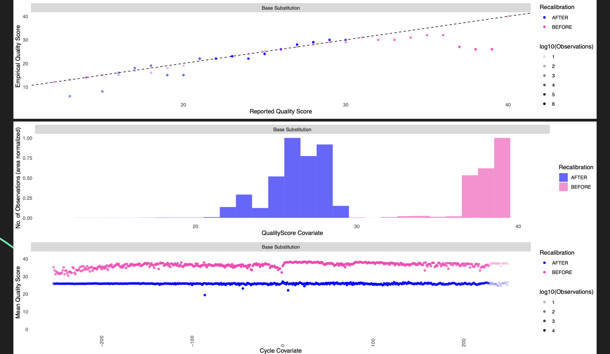
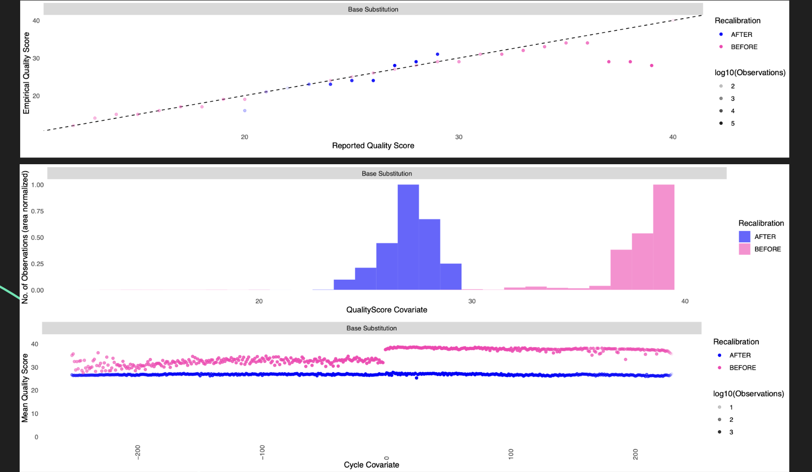

# [Monoclonal antibodies derived from B cells in subjects with cystic fibrosis reduce _Pseudomonas aeruginosa_ burden in mice](https://pmc.ncbi.nlm.nih.gov/articles/PMC11030358/)

  Projekt koncentruje się na opracowaniu wysokoaffinicznych przeciwciał monoklonalnych (mAbs) skierowanych przeciwko PcrV — czynnikowi wirulencji Pseudomonas aeruginosa (PA).
W ramach tego projektu zastosowano innowacyjną strategię izolacji PcrV-specyficznych limfocytów B z krwi osób z mukowiscydozą, u których zachowana jest prawidłowa odpowiedź adaptacyjna. Przy użyciu tetrameru PcrV i technik sortowania pojedynczych komórek oraz sekwencjonowania łańcuchów zmiennych receptorów BCR, zidentyfikowano sekwencje umożliwiające produkcję wysokospecyficznych przeciwciał.  Otrzymane przeciwciała monoklonalne wykazywały silną aktywność przeciwko PA w modelu zapalenia płuc u myszy. 

  Kluczowy problem badawczy dotyczył nieskuteczności dotychczasowych terapii opartych na przeciwciałach przeciwko PcrV.
Projekt odpowiada na pytanie, czy izolacja naturalnych, wysokospecyficznych przeciwciał przeciwko PcrV z ludzi, a konkretnie z pwCF, pozwoli na uzyskanie bardziej skutecznych kandydatów terapeutycznych. Celem było nie tylko stworzenie nowych przeciwciał o wysokim powinowactwie, ale także lepsze zrozumienie odpowiedzi humoralnej przeciwko PA u pacjentów z mukowiscydozą.


## Etapy analizy

Cały pipeline może zostać uruchomiony na raz poprzez [Main](./main_pipeline.sh)

### 1. Pobranie surowych danych eksperymentalnych z użyciem Fasta-Dump
Dane zostały ograniczone do dwóch próbek pochodzących od dwóch różnych osób, wykazujących różne natężenie zakażeń PA.

`fastq-dump --split-files -X 1000000 --gzip --progress SRR32572150 SRR32572151`

### 2. Przygotowanie  danych referencyjnych i VCF (zob. [data preparation](./prepare_references.sh))
Homo Sapiens Primary Assembly:


```
wget ftp://ftp.ensembl.org/pub/release-110/fasta/homo_sapiens/dna/Homo_sapiens.GRCh38.dna.primary_assembly.fa.gz
gzip -d Homo_sapiens.GRCh38.dna.primary_assembly.fa.gz
bwa index -a bwtsw Homo_sapiens.GRCh38.dna.primary_assembly.fa
```


Homo Sapiens Somatic VCF:

```
wget https://ftp.ensembl.org/pub/release-114/variation/vcf/homo_sapiens/homo_sapiens_somatic.vcf.gz
gzip -d homo_sapiens_somatic.vcf.gz
gatk IndexFeatureFile -I homo_sapiens_somatic.vcf
```

### 3. Weryfikacja jakości danych przy pomocy FastQC 
`fastqc -o reports/ *.fastq`

### 4. Trymowanie danych przy pomocy Trimmomatic (zob. [trimming](./trimming.sh) )
Z wykorzystaniem parametrów trymowania:
- PE -phred33
- ILLUMINACLIP:/usr/local/bin/Trimmomatic-0.39/adapters/TruSeq3-PE.fa:2:30:10
- LEADING:10 TRAILING:10 SLIDINGWINDOW:5:30 MINLEN:70

*kolejność komend ma znaczenie*

W efekcie uzyskano:

| Próbka       | Input Read Pairs | Both Surviving (%) | Forward Only Surviving (%) | Reverse Only Surviving (%) | Dropped (%) |
|--------------|------------------|---------------------|-----------------------------|-----------------------------|--------------|
| SRR32572150  | 58,906           | 12,996 (22.06%)     | 38,818 (65.90%)             | 846 (1.44%)                 | 6,246 (10.60%) |
| SRR32572151  | 116,294          | 4,783 (4.11%)       | 102,274 (87.94%)            | 98 (0.08%)                  | 9,139 (7.86%)  |


### 5. Weryfikacja jakości strymowanych danych przy pomocy FastQC i wizualizacja raportów z MultiGC


### 6. Alignment (zob. [alignment](./alignment.sh) ) i dodanie Read Groups
Nagłówki danych użyte do zidentyfikowania ReadGroups:

```
@SRR32572147.1 M02172:273:000000000-DJPRD:1:1101:15616:1365 length=251
```
Alignment przeprowadzony z wykorzystaniem `bwa mem`

`bwa mem -R "@RG\\tID:${instrument}.${lane}\\tSM:${base_name}\\tPL:ILLUMINA\\tLB:lib1\\tPU:${instrument}.${lane}.${base_name}" ${REF} ${R1} ${R2} > "$ALIGN_DIR/${base_name}.sam"`

### 7. Post-alignemnt (zob. [post alignment](./post_align.sh) )
Etap składający się z kilku kroków (wykorzystujących pakiet samtools):
- sort
- fixmate
- sort
- markdup
- index
- flagstat
- depth

### 8. Base Quality Score Recalibration with GATK (zob. [BGSR](./bgsr.sh))
Z wykorzystaniem narzędzi BaseRecalibration i ApplyBQSR z pakietu GATK oraz indexowanie plików .bam z użyciem samtools.

Sample: SRR32572150




Sample: SRR32572151




### 9. Analiza kowariancji (zob. [analyze covariates](./analyze_covariates.sh))
Przeprowadza ponowanie BaseRecalibraiton w celu porównania jakości wyników BQSR. 


### 10. Variant Calling V.1 z użyciem HaplotypeCaller GATK (zob. [GATK cariant calling](./gatk_variant_calling.sh) )

| Sample       | Variants Identified | Variants Filtered | Variants After Filtration |
|--------------|---------------------|--------------------|----------------------------|
| SRR32572150  | 208                 | 71 (34%)           | 137                        |
| SRR32572151  | 115                 | 61 (53%)           | 54                         |


### 11. Variant Calling V.2 z użyciem mpileup BCFTools (zob. [BCF variant calling](./bcf_variant_calling.sh) )

| Sample       | Variants Identified | Variants Filtered | Variants After Filtration |
|--------------|---------------------|--------------------|----------------------------|
| SRR32572150  | 182                 | 78 (43%)           | 104                        |
| SRR32572151  | 96                  | 55 (57%)           | 41                         |


### 12. Variant Effect Predictor - web tool from ensemble


### 13. Functional analysis with G-Profile

Zidentyfikowano najbardziej istotne kategorie funkcjonalne wykazujące zmiany:
- antigen binding / adaptive immune response (GO:MF:0003823, GO:BP:0002250)
  - Powiązane z rozpoznawaniem antygenów i inicjację odpowiedzi immunologiczne.
  -  Takie polimorfizmy mogą wpływać na zdolność do rozpoznawania patogenów i efektywność odpowiedzi odpornościowej

- immunoglobulin complex (GO:CC:0019814)
  - Zmiany składu, stabilności lub funkcji kompleksów immunoglobulinowych.
  - Mogą zaburzać zdolność wiązania patogenów oraz zmiany w poziomie aktywności układu odpornościowego.

- extracellular region / plasma membrane / blood microparticle
   - Te zmiany mogą powodować zaburzenie komunikacji między komórkami odpornościowymi i  przekazywania sygnałów zapalnych
   - Mogą też zwiększyć przepuszczalność nabłonka oddechowego (co sprzyja kolonizacji przez bakterie).


